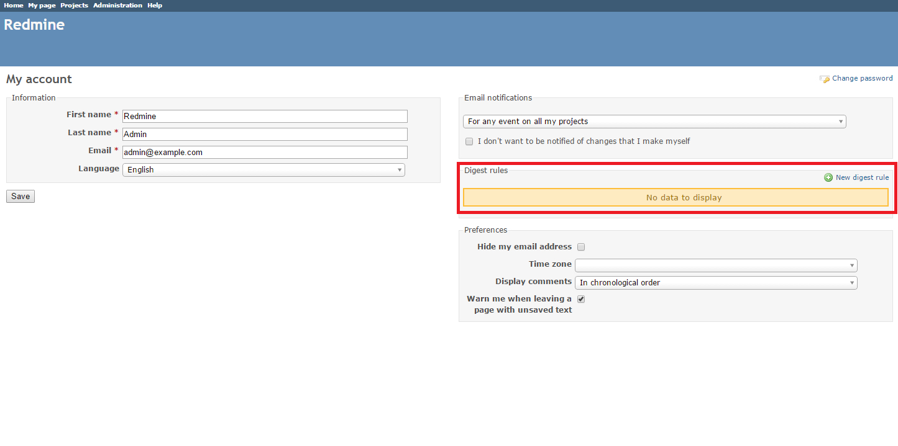
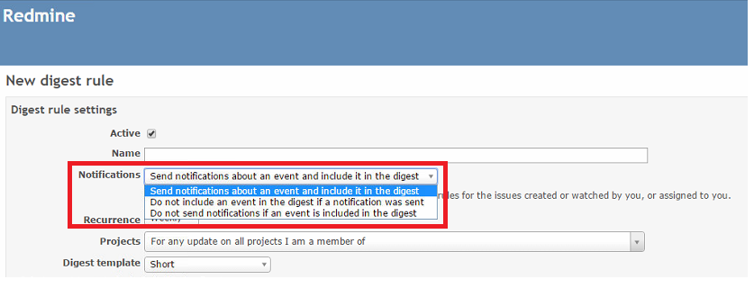
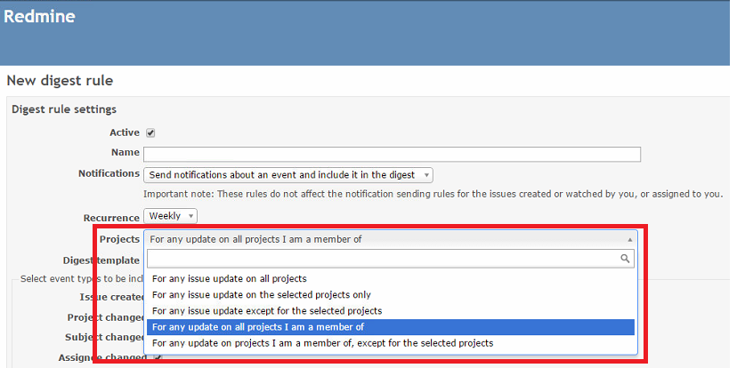
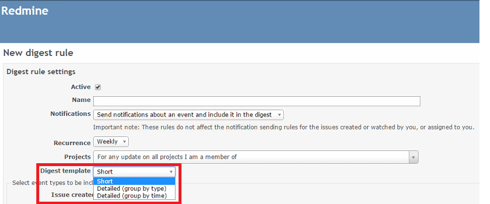
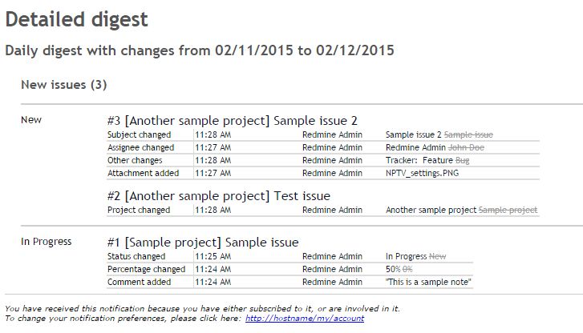
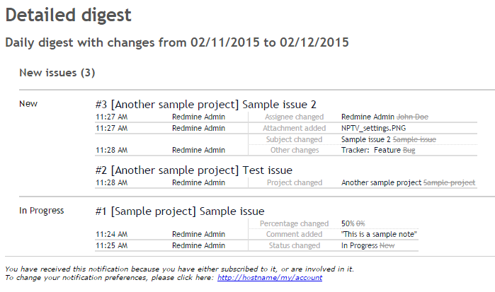

# Redmine Digest Plugin

This plugin enables you to send and receive daily, weekly and monthly Redmine digests.

## Compatibility

This plugin version is compatible only with Redmine 2.2.x and later.

## Installation

1. To install the plugins
    * Download the .ZIP archives, extract files and copy the plugin directories into #{REDMINE_ROOT}/plugins.
    
    Or

    * Change you current directory to your Redmine root directory:  

            cd {REDMINE_ROOT}
            
      Copy the plugins from GitHub using the following commands:
      
            git clone https://github.com/Undev/redmine__select2 plugins/redmine__select2
            git clone https://github.com/Undev/redmine_digest.git plugins/redmine_digest
            
2. Install the required gems using the command:  

        bundle install  

    * In case of bundle install errors, remove the Gemfile.lock file, update the local package index and install the required dependencies. Then execute the bundle install command again:  

            rm Gemfile.lock
            sudo apt-get update
            sudo apt-get install -y libxml2-dev libxslt-dev libpq-dev
            bundle install
            
3. These plugins require a migration. Run the following command to upgrade your database (make a database backup before):  

        bundle exec rake redmine:plugins:migrate RAILS_ENV=production

4. Restart Redmine.

Now you should be able to see the plugins in **Administration > Plugins**.

5. Modify the crontab file to configure the sending schedule for daily, weekly and monthly digests. For example, to send daily digests every day at 01:00, weekly digests every Monday at 02:00 and monthly digests every 1st day of the month at 03:00, use the following commands:

        0 1 * * * rvm use ruby-1.9.3 && cd /var/www/redmine && RAILS_ENV=production bundle exec rake redmine_digest:send_daily
        0 2 * * 1 rvm use ruby-1.9.3 && cd /var/www/redmine && RAILS_ENV=production bundle exec rake redmine_digest:send_weekly
        0 3 1 * * rvm use ruby-1.9.3 && cd /var/www/redmine && RAILS_ENV=production bundle exec rake redmine_digest:send_monthly

## Usage

The plugin enables you to create daily, weekly or monthly digests according to the user-defined rules.

To create a digest rule, click **My account** and then click **New digest rule**.  

Specify the rule name, select which events should be included in a digest (all options are enabled by default) and configure other options as necessary. The following settings are available:  

In the notifications field, the **Send notifications about an event and include it in the digest** value is selected by default. Other options are as follows:  

By default, digests are sent once a week. To set another interval, change the value in the **Recurrence** field.  

In the **Project** field, you can specify whether to updates of certain projects should be included in the digest or excluded from it:  

In the **Digest template** field, you can choose between a short or a detailed (grouped either by event type or by event time) digest template:  

A short digest lists an highlights the project changes:

A detailed digest displays both the changed and new values, shows the time and author of the updates.  
  

You can create as many digest rules as needed. You can also preview, edit or delete the created  digest rule on **My account** page.  

## License

Copyright (c) 2015 Undev

Licensed under the Apache License, Version 2.0 (the "License");
you may not use this file except in compliance with the License.
You may obtain a copy of the License at

http://www.apache.org/licenses/LICENSE-2.0

Unless required by applicable law or agreed to in writing, software
distributed under the License is distributed on an "AS IS" BASIS,
WITHOUT WARRANTIES OR CONDITIONS OF ANY KIND, either express or implied.
See the License for the specific language governing permissions and
limitations under the License.
